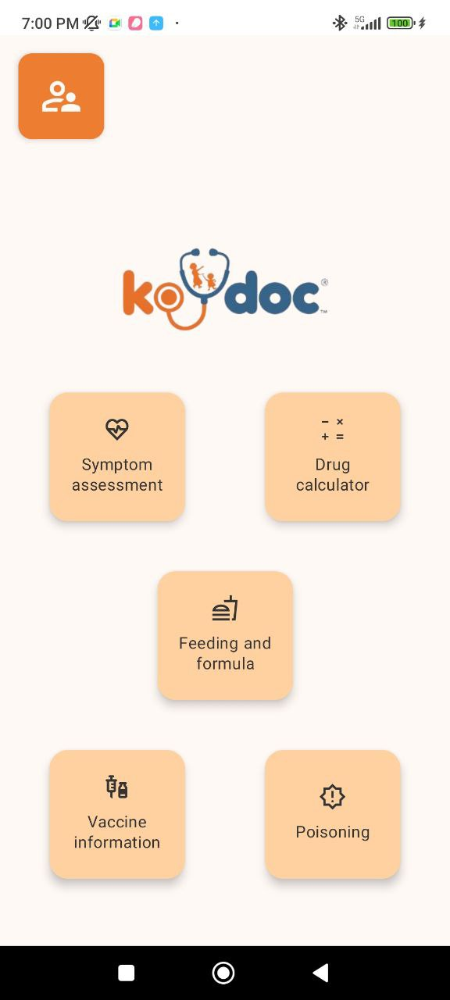
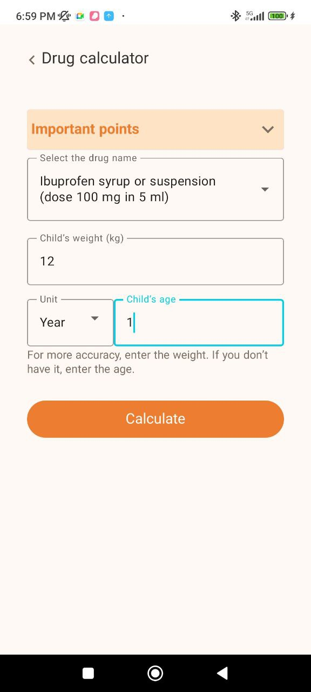
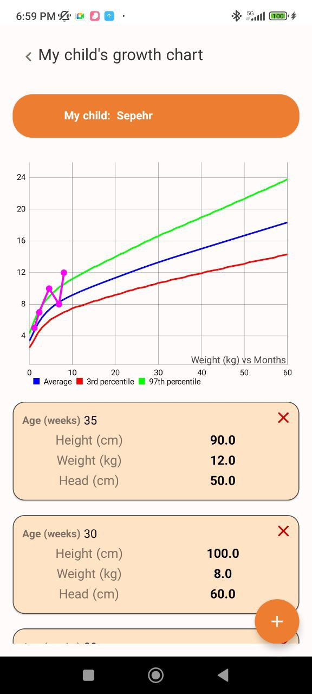
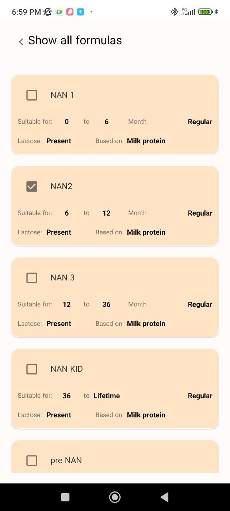
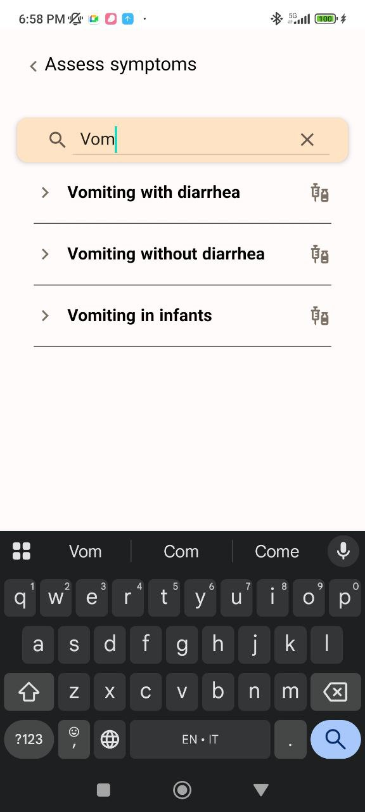
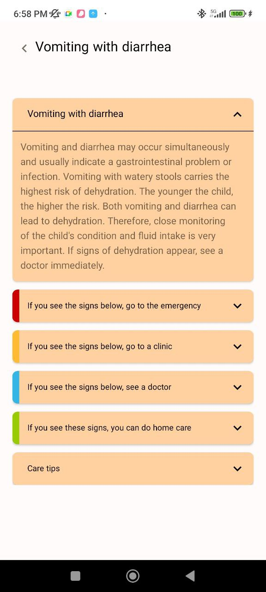
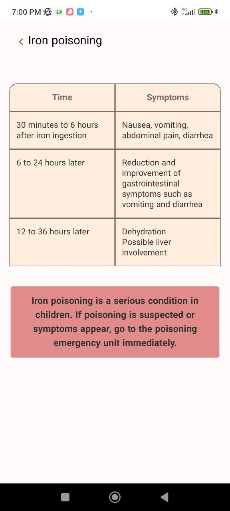
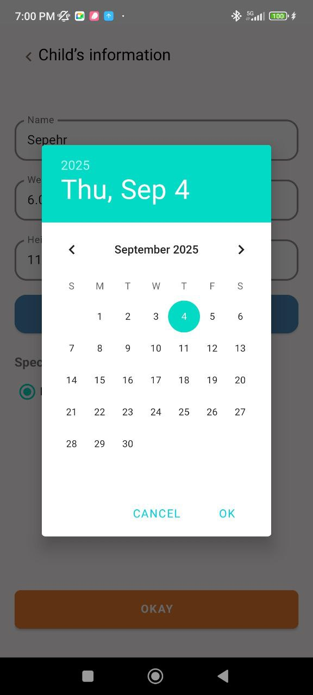

# 👶 Koodoc: Your Child's Health Companion

Koodoc is an Android application designed to empower parents with essential tools and information to monitor and care for their children’s health. Bridging the gap between professional medical care and day-to-day parental health management, Koodoc (derived from "Doctor" and "Koodak" - Persian for kid) is especially vital in regions with limited medical infrastructure.

---

## 🚀 Why Koodoc?

- **Prevents Medication Errors**  
  Calculates accurate dosages based on child's weight and age, significantly reducing risks of underdosing or overdosing.

- **Early Growth Detection**  
  Tracks growth against standardized percentile curves, enabling early identification of developmental irregularities.

- **Empowers Parents**  
  Provides reliable, evidence-based health information, fostering confident parenting and better health outcomes.

---

## 📱 Key Features

Koodoc offers a comprehensive suite of tools, all within a bilingual (Farsi/English) and RTL/LTR UI supported environment:

---

### 🏠 Home Dashboard
Clean and simple home screen to navigate between features.  

---

### 🧮 Drug Calculator
Accurately determine safe dosages of common medicines based on weight and age.  

---

### 📊 Growth Chart
Visualize your child's physical development (weight, height, head circumference) against percentile curves.  

---

### 🍼 Feeding & Formula Suggestions
Personalized milk formula recommendations based on age, allergies, and nutrition needs.  

---

### ❤️ Symptom Assessment
Quickly check symptoms like vomiting, diarrhea, or fever and get guidance on whether to seek medical care.  
  

---

### ⚠️ Poisoning Awareness
Critical information on poisoning risks (like iron poisoning) with clear timelines and emergency guidance.  

---

### 💉 Vaccine Information
Provides structured information on vaccines and schedules (future updates will add reminders).

---

### 👶 Child Profile
Create detailed child profiles including birthday, weight, height, and head size to personalize recommendations.  

---

## 🛠 Technical Highlights

Built with modern Android technologies:

- **Kotlin** as the primary language  
- **Android Jetpack** (Navigation, Room DB, LiveData, ViewModel)  
- **Dagger Hilt** for dependency injection  
- **MPAndroidChart** for interactive growth chart visualizations  
- **Advanced Localization** with dynamic RTL/LTR support  

---

## ▶️ Getting Started

1. Clone the repo  
2. Open with **Android Studio**  
3. Run on an emulator or device  
4. Or build the APK and install directly  

---

## 🔮 Future Enhancements

- Vaccination scheduler with push notifications  
- Account syncing across multiple devices  
- Accessibility upgrades: dark mode, large fonts, screen reader support  

---

## 📜 License

No license is available for this project.  
No one can use or modify the code without the owner's permission.

---
